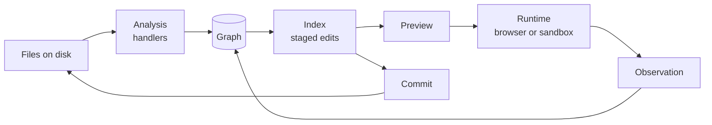

# Source graph — design synthesis

> **Status: superseded where [the vision](vision.md) disagrees.** Kept as the design record the vision was drawn from. Two things have moved since it was written: the library is named Provenance, and offsets count **bytes**, not UTF-16 code units (settled 2026-09-23; the vision says why).

Sep 22, 2026 · @Someone

## Purpose and scope

The source graph is a language-agnostic library that knows, for one rendered document, every source file involved, how those files depend on each other, where each rendered thing came from, and how to write changes back to disk. One structure answers two questions that today need separate bookkeeping: what did the browser actually load, and which files must the server change.

Status: day-zero design, unnamed (name pending its reserved-words check). It is the foundation of the companion CSS tools document, which builds on its addresses and its edit model. Claims carry round one's provenance tags: **checked** (verified against a spec or real docs), **settled** (argued and landed, untested in code), **pinned** (decided, with a falsifiable test), **open**.

The library does four things:

- **Tracks sources of any kind**: Markdown, HTML, CSS, images, fonts, and whatever a handler teaches it.
- **Records dependencies twice**: declared (found by parsing) and observed (seen at runtime), and reports where the two disagree.
- **Addresses rendered output**: any rendered node can say which file and which span produced it.
- **Stages edits**: holds changes against source, previews them, and commits them to disk together.

It deliberately does not:

- **Render or transform.** BelType turns Markdown into HTML; the graph only analyzes, addresses and watches.
- **Understand any language's semantics.** Cascade reasoning lives in the CSS tools; the graph knows spans, not meanings.
- **Keep history.** Git does. Commit here means writing files; a VCS commit may follow, and is the consumer's call.
- **Serve files.** The server does, and tells the graph which URL serves which source.

The unit of work is a **session**: one entry document, everything reachable from it, and one runtime observing it. This matches BelType's one document per stage (settled).

## Principles

Seven rules, all settled; everything in the model follows from them. Each names what it borrows.

1. **One address space.** Every fact the library holds is stated against an address: source, version, range. Edges, stamps, observations and edits all speak it, so any two facts can be joined. (Borrowed from LSP's versioned documents and unist positions.)
2. **Handlers declare; the graph decides.** A handler reads text and reports what it found: dependency requests and embedded regions. Resolving, caching, watching and writing belong to the graph alone. (PostCSS dependency messages; Parcel transformers.)
3. **Derived facts are pure functions of versions.** Every analysis is cached by content hash, so a new version invalidates it by construction. There is no manual invalidation call anywhere. (Salsa; Build Systems à la Carte.)
4. **Declared and observed stay separate.** Runtime observation never overwrites parsed structure; the graph reports the difference instead. A disagreement is information, not an error to smooth over.
5. **Source is the stored reality; renders are projections.** Round one's two-worlds rule, generalized. Stamps live in `data-*` on rendered output; nothing the graph needs ever enters a source file.
6. **Nothing touches disk before commit.** Edits are staged against a base version, previewed in memory, and written together. (LSP `WorkspaceEdit`; git's index.)
7. **Languages are plugins; nesting is delegation.** The core knows no language. A handler hands an embedded region to another handler, with a map back to the host's positions. (Volar.)

## The model

Five nouns make the whole model; everything else is a loop over them (settled). Stamps and observations are not extra nouns: a stamp is an address written into the DOM, an observation is an edge with a different origin.

| Noun | What it is | Fields |
| --- | --- | --- |
| **Source** | A file the graph knows, or a virtual file carved out of one (a `<style>` block inside HTML). | id (graph-minted, stable), path, kind, version (content hash); virtual sources add host and a position map. |
| **Address** | A place in a source at a known version. | source, version, range as start and end offsets; omitted range = the whole file. |
| **Edge** | A dependency from a place in one source to another source. | from (an address: the span that asks), request (as written), target (a source, or unresolved), kind (`requires` or `candidate`), origin (`declared` or `observed`). |
| **Handler** | The plugin for one language. | language, which paths it claims, `analyze(text)` returning requests and embedded regions; optional artifacts (such as an AST) for consumers. |
| **Edit** | A change staged against source. | a text edit (address in the base version plus new text) or a file operation: create, delete, rename. |

Binary sources (images, fonts) are leaves: no handler parses them, but they are addressable as whole files, can be edge targets, and can be created or replaced by file operations.

Offsets count UTF-16 code units, JavaScript's native string index, so ranges index directly into loaded text (settled; see Open questions for the disk encoding). Lines and columns are derived for display only.

Three loops run over the graph: analysis fills it with declared edges, observation adds observed ones, editing stages changes, previews them, and commits them back to disk.



The preview feeds the runtime, so what the user sees is always base plus index; commit closes the circle by making that the new base.

## Loop one — analysis

Analysis turns files into declared edges by a simple fixpoint: analyze the entry, resolve its requests, analyze whatever they reach, and stop when nothing new appears (settled). Includes are only discovered by parsing, which is what Build Systems à la Carte calls dynamic dependencies; a worklist handles them without a scheduler.

### The handler contract

A handler is a pure function from text to findings; it never touches the filesystem (settled).

```
analyze(text) → {
  requests: [{ range, request, kind }],   // what this text asks for
  regions:  [{ range, language, map }],   // embedded text for another handler
  base?:    string                        // e.g. HTML <base href>
}
```

Everything else is the graph's job. A handler may also expose **artifacts** (its parse tree, such as a PostCSS root or an mdast tree), cached by version, with positions already in the shared address space. That is how the CSS tools get a lossless AST whose every node has an address.

### Edge kinds

The kind says whether loading the host guarantees loading the target (settled):

- **`requires`**: guaranteed. A Markdown include, an unconditional `@import`, an eager `img src`.
- **`candidate`**: the runtime decides. A `srcset` entry, `image-set()`, a media-conditioned `@import`, a lazy image, every `@font-face` source, and nearly every `url()` in a CSS rule, since it loads only if a matching element exists.

The distinction matters in loop two: an unloaded candidate is normal, an unloaded requirement is a problem.

### What each handler declares

| Handler | Requests | Regions it delegates |
| --- | --- | --- |
| Markdown | include directive (`requires`), images | raw HTML blocks and inline HTML → HTML |
| HTML | `link href`, `img src` and `srcset`, `source`, `video`/`audio`, `iframe`, `object`, SVG `use href`; `<base href>` sets the base | `<style>` → CSS stylesheet; `style` attribute → CSS declarations |
| CSS | `@import` (with its layer and condition recorded), `url()` and `image-set()`, `@font-face` `src` | none in v1 |
| Binary (images, fonts) | none | none |

Scripts are out of scope for v1: they are opaque to analysis, and whatever they fetch shows up in loop two as observed-only (settled).

### Resolution and probes

The graph resolves each request against a base: by default the host's real file, overridable by the handler (HTML `<base>`). Virtual sources inherit their host's base, so a `url()` inside an HTML `<style>` resolves against the document, as browsers do. Resolvers are pluggable by scheme: relative paths, packages, `http(s)` (an external leaf), `data:` (no edge at all).

Every resolver records its **probes**: each path it tried, including those that did not exist. A file appearing at a probed path invalidates the edge, which is Parcel's `invalidateOnFileCreate` made general. Unresolved edges are first-class, so a broken include is visible in the graph and heals itself when the file appears.

Include cycles are recorded as edges and reported, never followed forever.

### Embedded languages

A region becomes a **virtual source**, analyzed by the handler for its language, carrying a map back to the host. Nesting composes: Markdown holds raw HTML, which holds a `<style>`, which holds a `url()`, and the font it names still points to the right line of the right Markdown file.

The map is a list of segments, after Volar's mappings. Most segments are linear: offsets shift by a constant. Where the host escapes text (an HTML entity inside a `style` attribute), the segment is marked **opaque**: positions inside it map to the whole segment, and edits there are refused (see Open questions). Volar attaches flags to each mapping saying which features it supports; ours needs only one, editable.

### Caching and invalidation

Analysis is cached by handler plus content hash. A watcher event produces a new version of that source only; the graph re-analyzes it, re-resolves its edges, and re-resolves any edge whose probes the event touched. Nothing else is recomputed, and no code ever calls "invalidate" (settled, after Salsa's model; untested here).

Two refinements come from prior art. Probes belong to the cached result, so a cache hit re-registers them; Parcel once lost include invalidations by skipping exactly this. And when re-analysis yields identical findings, nothing downstream re-runs, which Salsa calls backdating.

## Loop two — observation

Observation records what the runtime actually fetched as edges with origin `observed`, and reconciliation reports how they differ from the declared ones (settled). The graph never merges the two; the gap between them is the product.

### The URL map

The runtime speaks URLs, the graph speaks sources, so nothing joins without a map. The server owns it: for every source it serves, including preview versions, it tells the graph which URLs serve it. The map is one-to-many: one file can be served under several URLs, as Vite's module graph also allows. An observed URL missing from the map was served by something outside the graph, and is reported as such.

### Observers, by scope

Observers are adapters that turn a runtime's events into observed edges. Pick by where the document renders:

| Scope | Tools | What was fetched | Who asked |
| --- | --- | --- | --- |
| In the page | Resource Timing via a `PerformanceObserver`; the CSS Font Loading API (`document.fonts`) for which faces actually loaded | yes | coarse: an initiator type only |
| Sandbox iframe | Its own path and service worker, so each session's fetches are isolated | nearly all network fetches | no |
| Headless Chromium in a container | The DevTools Protocol's Network domain | yes | yes: an initiator per request |

When the initiator is known, the observed edge starts at that source; otherwise at the session's entry. Initiator detail in the DevTools Protocol, especially for loads triggered by CSS, is to be verified against real traces before anything depends on it.

Observation is a window, not a moment. Lazy images and late font loads keep arriving, so the session keeps listening, and reconciliation is a query that can run at any time.

### Reconciliation

Each declared edge is matched against observations of its target, and every combination has one meaning:

| Declared | Observed | Meaning |
| --- | --- | --- |
| `requires` | loaded | As expected. |
| `candidate` | loaded | As expected; records which candidate the runtime chose (a `srcset` pick, a font face). |
| `candidate` | not loaded | Normal. Reports why when known: condition inactive, no matching element, not yet scrolled into view. |
| `requires` | not loaded | A problem: a broken path, a blocked request, a failed load. |
| none | loaded | A handler gap or a runtime injection (a script fetch). Always a warning: this is how handlers prove complete. |
| none, unmapped URL | loaded | Served from outside the graph. A warning. |

The fifth row is the important one. It is the same move as the Oracle in the CSS tools: a static prediction checked against runtime truth, where each mismatch names a real gap (settled).

## Loop three — editing

Edits are staged in an index, previewed in memory, and committed to disk together; what gets written is byte for byte what the preview showed (settled). That identity is what makes automatic commit trustworthy, and it comes from one decision: every edit is a text splice.

### Edits are splices

The graph edits text, never trees. A language-aware consumer (the CSS tools setting a declaration's value) computes the splice from its AST's positions, then hands the graph a plain text edit. Untouched bytes stay untouched by construction, so formatting and comments survive without any printer (settled).

Within one source, staged edits follow LSP's rule: they never overlap, and all refer to the base version, never to each other's results. Applying them is sorting by offset, last first, and splicing.

### Index and preview

The **index** holds staged edits, grouped. A group is one intent from a consumer (an amendment touching two files, say), labelled, and unstageable as a unit, like dropping a hunk in git. LSP's change annotations have the same shape: a label, a description, and a needs-confirmation flag, which lets a consumer mark one group for review while the rest commits automatically.

The **preview** is base plus index: a preview version of each touched source, with its own content hash. Loop one analyzes preview versions like any others, so an edit that adds an include shows its new edge at once. The server serves the preview through the URL map, so the runtime renders exactly what would be committed.

The user acts on the preview, whose offsets differ from the base. The index keeps a position map per source, after ProseMirror's step maps. A preview position outside staged text maps back to the base; one inside a staged insertion amends that staged edit instead of adding an overlapping one, so the no-overlap rule always holds.

### Commit

Commit checks that each touched file on disk still has its base hash, writes every new content to a temporary file beside its target, then renames each over its target. A rename is atomic per file on one filesystem; across files the commit is best effort, rolling back already-renamed files if a later one fails. File operations (create, delete, rename) follow the text writes.

Afterwards, preview versions become base versions and the index empties: the stage reality is the new reality. A consumer may follow with a VCS commit; the index can supply a message naming each group.

### Rebase

When the watcher reports a disk change to a source with staged edits, the index rebases at once rather than at commit. Each edit looks for its original span's text, with a little surrounding context, in the new version. A unique match moves the edit; anything else marks it **conflicted**, which blocks its group until it is resolved or dropped. This is patch-with-context, as git applies it.

### Pinned tests

- **Identity**: the bytes written equal the preview's bytes, for every touched file.
- **Containment**: a byte diff between base and committed file touches only staged ranges.
- **Rebase**: an edit survives an unrelated upstream change in the same file, and conflicts on an overlapping one.

## Provenance in renders

Any rendered thing can answer "where did I come from?" with an address, through one of three routes: stamps for content, the URL map for resources, and the CSS tools for style (settled).

### Stamps

A stamp is an address written into the render as a `data-*` attribute: a source id and a range, such as `data-src="s12:1840-1932"`. Versions stay out of the attribute; the session keeps a render manifest recording which version of each source a render used. Stamps live only in renders, never in source (principle 5).

Only the renderer can stamp, because only it knows which output came from which input. The library supplies the codec and helpers, such as a rehype plugin that turns hast positions into stamps. cmark's `data-sourcepos` is the precedent, but it records only line and column. Once includes exist, the stamp must also name the file: nodes expanded from an included Markdown file carry that file's source id.

Stamping is block-level by default: headings, paragraphs, list items, figures, tables. `locate(node)` walks up to the nearest stamped ancestor, so inline content resolves to its block without stamping every span. Nodes the renderer generates itself carry no stamp, following unist's rule that generated nodes have no position; parse5 likewise leaves elements it implies without a location.

### The three routes

| Rendered thing | Route | Answer |
| --- | --- | --- |
| An element's content | its stamp, via `locate` | the source span that produced it |
| A loaded resource (an image, a font) | its resolved URL, via the URL map | the source file |
| A style applied to an element | the CSS tools' rule-to-address map | the rule and declaration spans |

### Stale renders

A render is of one version, and the preview moves on as edits are staged. An address from an older render is still valid at its version; the index's position map translates it to the current preview. Nothing needs re-rendering just to keep addresses usable (settled).

## Boundaries

The graph owns files, addresses, edges and edits; everything about meaning or rendering sits above it (settled). The split below is what should move out of BelType today.

| Concern | Source graph | CSS tools | BelType |
| --- | --- | --- | --- |
| Which files exist and depend on which | owns | — | provides handlers config and entry |
| Markdown include directive | its Markdown handler declares the edge | — | defines the syntax and expands it when rendering |
| Rendering and stamping | codec and helpers | — | owns |
| Serving files and previews | receives the URL map | — | owns the server, provides the URL map |
| What the browser loaded | observers and reconciliation | — | chooses the scope (page, sandbox, headless) |
| CSS meaning: cascade, vars, reach | — | owns, on the CSS handler's addressed AST | consumes |
| `@page` and paged-media rules | addresses them | queryable like any rule | owns their behavior |
| Amendments | holds them as edit groups in the index | builds them from a chosen rung | shows the UI |
| Writing to disk | commit and rebase | — | decides when to commit |

### Vocabulary shared with the CSS tools

The two documents use "stage" in one consistent sense. The **Stage** is the browser projection the CSS tools build from the graph's preview versions. **Staged edits** are the index's contents: edits playing on the stage, not yet committed. The source graph itself never builds a stage; it supplies what one is built from.

The ProseMirror editor comes later. Whether an editor document is a source whose edits flow through the index, or a consumer with its own transaction history, is left open deliberately.

## Open questions

- [ ] **Disk encoding.** Offsets are UTF-16 in memory, files are bytes on disk. Decide how a byte-order mark and non-UTF-8 files round-trip; the identity test must hold across decode and re-encode.
- [ ] **Edits in opaque segments.** Refuse in v1, or let the host handler re-escape the new text (entities in an HTML attribute)?
- [ ] **Multi-file atomicity.** Best-effort renames with rollback, or a small journal? Or is the VCS the real safety net and best effort enough?
- [ ] **Stamp granularity.** Block-level stamps serve most needs; decide whether run-level stamps are needed for inline amendments.
- [ ] **Observer fidelity.** Verify against real traces what the DevTools Protocol reports as initiator for CSS-triggered loads, and which fetches a service worker misses (memory-cache reuse).
- [ ] **Scripts.** Out of scope for v1; decide whether a script handler ever joins, or scripts stay observed-only.
- [ ] **Include cycles.** Reporting is settled; decide whether a cycle also blocks rendering.
- [ ] **Watching.** Choose the watcher and a debounce, and check that editors saving by write-then-rename look like one change, not a delete and a create. Vite reads changed files through a helper because change events can fire before the editor finishes writing; the same care applies here.
- [ ] **Editor documents.** Sources whose edits go through the index, or consumers with their own history (see Boundaries).
- [ ] **The library's name**, with the usual reserved-words check.

## References

Each reference is here for one specific lesson, noted beside it. Links marked \* were confirmed by search while drafting; the rest are well-known pages to re-check before relying on details.

| Reference | What it lends | Used in |
| --- | --- | --- |
| [Vite plugin API](https://vite.dev/guide/api-plugin)\* | a module graph of importers and imports; one file mapping to several served modules; reading changed files through a helper | URL map, watching |
| [Parcel: authoring plugins](https://parceljs.org/plugin-system/authoring-plugins/)\* | `invalidateOnFileChange` and `invalidateOnFileCreate`, including glob and "file above" forms | probes |
| [Parcel PR #6072](https://github.com/parcel-bundler/parcel/pull/6072)\* | cache hits must re-register invalidations | caching |
| [PostCSS runner guidelines](https://postcss.org/docs/postcss-runner-guidelines)\* | plugins declare dependencies as messages; the runner watches them | handler contract |
| [unist](https://github.com/syntax-tree/unist)\* | positions with line, column and offset; generated nodes carry none | addresses, stamps |
| [vfile](https://github.com/vfile/vfile)\* | a virtual file with path history and located messages | sources |
| [parse5 parser options](https://parse5.js.org/interfaces/parse5.ParserOptions.html)\* | `sourceCodeLocationInfo`; implied elements have no location | HTML handler, stamps |
| [cmark(1)](https://man.archlinux.org/man/cmark.1.en)\* | `--sourcepos`: source positions stamped on rendered HTML | stamps |
| [remark-directive](https://github.com/remarkjs/remark-directive) | a tested directive syntax, a candidate shape for includes | Markdown handler |
| [Volar.js](https://github.com/volarjs/volar.js)\* | virtual code with mappings back to the host, per-mapping feature flags | embedded languages |
| [Volar mappings discussion](https://github.com/volarjs/volar.js/pull/247)\* | mappings can be continuous or discrete, and some features need continuous ones | opaque segments |
| [VS Code: embedded languages](https://code.visualstudio.com/api/language-extensions/embedded-languages) | the two classic approaches to languages inside languages | embedded languages |
| [LSP 3.17 specification](https://microsoft.github.io/language-server-protocol/specifications/lsp/3.17/specification/)\* | `WorkspaceEdit`: edits against the initial version, applied bottom-up, never overlapping; file operations; change annotations | editing |
| [ProseMirror guide: mapping](https://prosemirror.net/docs/guide/#transform.mapping) | positions mapped through a series of changes | index position map |
| [Build Systems à la Carte](https://www.microsoft.com/en-us/research/uploads/prod/2018/03/build-systems-a-la-carte.pdf)\* | dynamic dependencies; separating what to rebuild from in what order | analysis fixpoint |
| [Build systems à la carte: theory and practice](https://www.cambridge.org/core/journals/journal-of-functional-programming/article/build-systems-a-la-carte-theory-and-practice/097CE52C750E69BD16B78C318754C7A4)\* | the extended journal version | analysis fixpoint |
| [Salsa](https://github.com/salsa-rs/salsa)\* | memoized pure queries over revisions; backdating | caching |
| [Resource Timing (MDN)](https://developer.mozilla.org/en-US/docs/Web/API/Performance_API/Resource_timing) | what a page fetched, with a coarse initiator type | in-page observer |
| [CSS Font Loading API (MDN)](https://developer.mozilla.org/en-US/docs/Web/API/CSS_Font_Loading_API) | which font faces actually loaded | in-page observer |
| [Service Worker API (MDN)](https://developer.mozilla.org/en-US/docs/Web/API/Service_Worker_API) | intercepting a scope's fetches | sandbox observer |
| [DevTools Protocol: Network](https://chromedevtools.github.io/devtools-protocol/tot/Network/) | `requestWillBeSent` with a per-request initiator | headless observer |
